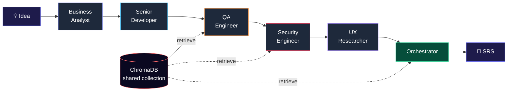
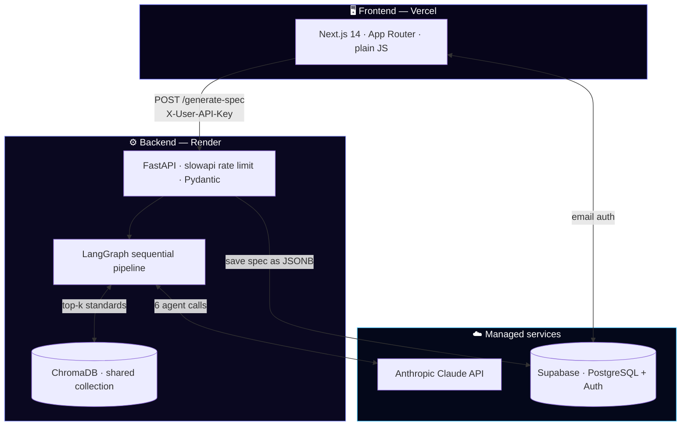

<div align="center">

# ⚡ SpecForge

### Six AI specialists analyze your product idea one after another — each building on the last — and hand you a complete software requirements spec at the end.

<br>

[](https://specforge-chi.vercel.app)
[](https://specforge-j74n.onrender.com)

<br>

[](https://www.python.org/)
[](https://fastapi.tiangolo.com/)
[](https://langchain-ai.github.io/langgraph/)
[](https://www.anthropic.com/)
[](https://www.trychroma.com/)
[](https://nextjs.org/)
[](https://supabase.com/)

[The problem](#-the-problem) • [Meet the agents](#-meet-the-agents) • [How it works](#-how-it-works) • [Quick start](#-quick-start) • [What broke](#-things-i-ran-into-and-fixed) • [Roadmap](#-roadmap)

</div>

---

## 🧩 The problem

Most software projects don't fail because of bad code. They fail because nobody figured out *what to actually build* before the code happened.

You sit through requirement meetings, write half-baked SRS docs, miss the edge cases, and find out in production that the auth flow makes no sense or the schema can't handle what was promised. Classic.

Normally, catching all that takes a **room full of specialists** — a business analyst, a senior dev, a QA engineer, a security expert, a UX researcher — hours of meetings to pull every angle out of a single idea. For a solo founder or a small team, that depth is out of reach.

**SpecForge compresses that entire room into ~5 minutes.**

You describe your product idea in plain English. Six specialized AI agents analyze it *in sequence* — each one reading everything the agents before it said — and the final agent synthesizes all of it into a complete, structured SRS document.

> It's **not** a single ChatGPT prompt in a nice wrapper. It's a sequential multi-agent pipeline with shared state, retrieval-grounded analysis, schema-validated outputs, and full production deployment.

---

## 🎬 Demo

**[▶ Try the live demo →](https://specforge-chi.vercel.app)**

*Bring your own Anthropic API key — new accounts get $5 free credit at [console.anthropic.com](https://console.anthropic.com). Your key is passed per-request and never stored.*

```
You: "A food delivery app for college campuses."
        │
        ▼
  ┌────────────────────────────────────────────────────────┐
  │  Business Analyst  →  is there a real market here?      │
  │  Senior Developer  →  can this actually be built?       │
  │  QA Engineer       →  what breaks in production?        │
  │  Security Engineer →  DPDP Act, auth, data exposure?    │
  │  UX Researcher     →  where do users get frustrated?    │
  │  Orchestrator      →  synthesize it all into an SRS     │
  └────────────────────────────────────────────────────────┘
        │
        ▼
  📄  MVP scope · functional + non-functional requirements
      security requirements · launch risks · final verdict
```

---

## 🤖 Meet the agents

Six agents run one after another. Each specialist reads the structured output of every agent before it, so the analysis **compounds** instead of repeating.

| Agent | Cares about | Won't shut up about |
|---|---|---|
| 🟣 **Business Analyst** | Market viability, monetization, scope | *"But who is this actually for?"* |
| 🔵 **Senior Developer** | Architecture, scalability, tech debt | *"We'll regret this in 6 months."* |
| 🟠 **QA Engineer** | Edge cases, failure modes, testability | *"What if the user does X instead?"* |
| 🔴 **Security Engineer** | Auth, data protection, compliance | *"Where's the DPDP consent flow?"* |
| 🟪 **UX Researcher** | Onboarding, accessibility, retention | *"Have you watched a real user try this?"* |
| 🟢 **Orchestrator** | Synthesis, conflict resolution, MVP scope | *"Here's what all five actually agree on."* |

The magic isn't any single agent — it's the **chaining**. A lone LLM gives you a generic list. Six agents reading each other surface the questions you didn't think to ask, and the Orchestrator explicitly calls out where they *disagree* instead of averaging the tension away.

---

## 🔧 How it works



1. **Input** — You describe your product idea and hit *Generate Spec*.
2. **RAG retrieval** — Agents that need grounding (especially Security) query a shared ChromaDB collection of real standards documents — OWASP, GDPR, India's DPDP Act 2023, SaaS architecture patterns, and an SRS template.
3. **Sequential pipeline** — A LangGraph `StateGraph` runs the six agents in order. Each writes its structured output into a shared state object that every downstream agent can read.
4. **Validation** — Every agent's response is parsed and validated against a Pydantic schema, with automatic retries on malformed JSON.
5. **Synthesis** — The Orchestrator reads all five specialists and produces the final SRS: MVP scope, functional & non-functional requirements, security requirements, and launch risks.

<details>
<summary><b>🔍 Why sequential instead of parallel or a debate loop? (click to expand)</b></summary>

<br>

Two design choices people ask about:

**Why not parallel?** Running all agents at once would be ~5x faster, but each would work in isolation with zero awareness of the others. Quality dropped noticeably in testing. Sequential chaining lets the analysis compound — if the Business Analyst flags a price-sensitive market, the Developer recommends a leaner architecture; if the Developer proposes collecting user data, the Security Engineer pulls the relevant DPDP Act clauses and flags the gap.

**Why not a multi-round debate?** Iterative back-and-forth debate (agents revisiting and refining across rounds) multiplies API cost and latency without a proportional quality gain for a requirements doc. SpecForge does a **single clean pass** — each agent runs once — and lets the Orchestrator do the reconciling at the end. Simpler, cheaper, and every claim is traceable to exactly one agent.

</details>

---

## 🏗️ Architecture



---

## 🛠️ Tech stack

**Backend**
- **FastAPI** — async Python API server
- **LangGraph** — the sequential multi-agent pipeline (`StateGraph` + shared `TypedDict` state)
- **Pydantic** — schema validation on every agent's JSON output, with retry-on-failure
- **ChromaDB** — one shared vector collection, `all-MiniLM-L6-v2` embeddings (384-dim)
- **slowapi** — IP-based rate limiting (3 requests / hour) to keep cost sane
- **Anthropic Claude** — `claude-sonnet-4-6` powers all six agents

**Frontend**
- **Next.js 14** (App Router) — single-page app, plain JavaScript, inline styles (no CSS framework)
- **Supabase Auth** — email/password with confirmation flow
- **Simulated streaming** — a single POST + measured `setTimeout` staging (see [what broke](#-things-i-ran-into-and-fixed))

**Data + Infra**
- **Supabase (PostgreSQL)** — two tables, generated specs stored as JSONB
- **Render** — backend hosting, GitHub auto-deploy
- **Vercel** — frontend hosting, zero-config Next.js

---

## 🔐 Bring your own key (BYOK)

SpecForge runs on **your** Anthropic API key, sent as a per-request header and never persisted.

```
Frontend  ──  X-User-API-Key  ──▶  Backend validates it  ──▶  used for all 6 agents
                                          │
                                  discarded when the
                                  request finishes —
                                  never logged, never stored
```

This is what keeps it live as a public demo: every user covers their own usage, so the project doesn't rack up someone else's API bill. New Anthropic accounts get **$5 in free trial credit**, enough for several full runs.

---

## 🚀 Quick start

### Prerequisites
- Python 3.10+
- Node.js 18+
- A Supabase project (free tier is fine)
- An Anthropic API key ([get one free →](https://console.anthropic.com))

### Setup

```bash
# 1. Clone
git clone https://github.com/Abhi-Beniwal/specforge.git
cd specforge

# 2. Backend
pip install -r backend/requirements.txt
# add your keys to backend/.env  (see below)
uvicorn backend.main:app --reload

# 3. Frontend (new terminal)
cd frontend
npm install
# add your Supabase vars to .env.local
npm run dev
```

Open `http://localhost:3000`, sign up, paste an Anthropic key, and forge your first spec.

### Environment variables

```env
# backend/.env
ANTHROPIC_API_KEY=sk-ant-...
SUPABASE_URL=https://xxx.supabase.co
SUPABASE_SERVICE_KEY=...

# frontend/.env.local
NEXT_PUBLIC_SUPABASE_URL=https://xxx.supabase.co
NEXT_PUBLIC_SUPABASE_ANON_KEY=...
```

---

## 📁 Project structure

```
specforge/
├── backend/
│   ├── agents/
│   │   ├── business_agent.py      # Business Analyst node
│   │   ├── developer_agent.py     # Senior Developer node
│   │   ├── qa_agent.py            # QA Engineer node
│   │   ├── security_agent.py      # Security Engineer node (heaviest RAG user)
│   │   ├── ux_agent.py            # UX Researcher node
│   │   ├── orchestrator_agent.py  # Final SRS synthesis
│   │   ├── pipeline.py            # LangGraph StateGraph wiring
│   │   ├── state.py               # Shared TypedDict state
│   │   └── utils.py               # JSON extraction, cost estimation, retries
│   ├── rag/
│   │   └── setup.py               # ChromaDB collection + retrieval
│   ├── database/
│   │   └── db.py                  # Supabase client + save logic
│   ├── documents/                 # 5 RAG source docs (GDPR, DPDP, OWASP, ...)
│   └── main.py                    # FastAPI app + endpoints
├── frontend/
│   ├── app/
│   │   ├── page.js                # Main single-page app
│   │   ├── login/page.js
│   │   ├── signup/page.js
│   │   └── layout.js
│   └── lib/
│       └── supabase.js            # Supabase client
└── README.md
```

---

## 🧯 Things I ran into (and fixed)

The interesting part of any real project isn't the happy path — it's what broke in production.

<details>
<summary><b>🌊 Render's free tier silently buffered all my SSE streaming</b></summary>

<br>

I originally streamed each agent's result to the browser in real time via Server-Sent Events. Worked perfectly locally. In production the frontend showed **nothing for 5 minutes**, then dumped all six results at once — no errors, just silently broken.

The cause: Render's free-tier proxy buffers responses and only flushes when the connection closes. SSE needs unbuffered streaming, and you can't disable buffering on the free tier.

**Fix:** switched to a single POST that returns the full result, and simulated sequential progress on the frontend with `setTimeout` using measured per-agent durations. From the user's side it looks identical to real streaming.

</details>

<details>
<summary><b>📦 ChromaDB downloaded a 79MB model on every cold start</b></summary>

<br>

The first request after a cold start took **6–7 minutes**. ChromaDB downloads a 79MB ONNX embedding model on first query, and Render wipes the filesystem on every cold start — so it re-downloaded every single time.

**Fix:** a frontend wake-up ping that warms the server first, plus committing the pre-built ChromaDB index to Git so documents don't re-embed on boot.

</details>

<details>
<summary><b>📱 Mobile Safari killed slow requests</b></summary>

<br>

On iPhone Safari, requests failed almost every time with "Load failed." Mobile Safari aggressively terminates idle connections that don't produce data within ~30 seconds.

**Fix:** the same wake-up ping — a fast `GET /` first, so the server is already awake before the heavy POST hits it, keeping it inside Safari's tolerance window.

</details>

<details>
<summary><b>🧩 The UX agent kept returning broken JSON</b></summary>

<br>

Most agents were reliable, but the UX Researcher failed JSON parsing after 3 retries. Logging the raw response showed it was cut off mid-sentence — its output (user journeys + retention + accessibility) is verbose and was hitting the token limit.

**Fix:** bumped `MAX_TOKENS` from 2500 → 4000 for the UX, Security, and Orchestrator agents specifically. Different agents need different budgets.

</details>

<details>
<summary><b>💸 One friend nearly drained my API credits</b></summary>

<br>

I deployed without rate limiting and shared the link with one person. Seven runs in fifteen minutes — about $1.40. At scale that would've emptied the balance in an hour.

**Fix:** added slowapi IP-based rate limiting (3/hour), and later the full BYOK model so usage cost never lands on me.

</details>

<details>
<summary><b>🔑 GitHub caught an exposed API key mid-push</b></summary>

<br>

Early on I accidentally committed an Anthropic key. GitHub's secret scanning blocked the push instantly.

**Fix:** rotated the key immediately, added `.env` to `.gitignore`, and rewrote the git history to strip the exposed commit. Lesson learned — gitignore secrets from commit #1.

</details>

---

## 🗺️ Roadmap

- [x] Six-agent sequential pipeline (LangGraph)
- [x] Shared ChromaDB RAG grounding
- [x] FastAPI backend + Pydantic validation
- [x] Supabase auth + spec history
- [x] Rate limiting + BYOK cost control
- [x] Downloadable SRS report (HTML → PDF)
- [ ] History dashboard — browse and re-open past specs
- [ ] Export to Markdown / Notion
- [ ] User-defined custom agents
- [ ] Hindi / Hinglish prompt support for Indian users
- [ ] "What changed?" diff view between two ideas

---

## 🤔 FAQ

**Why not just ask ChatGPT for an SRS?**
Tried it — you get a generic, single-perspective list. SpecForge's value is the *layering*: six specialists each reading the others, plus RAG grounding for real compliance standards. That's where the requirements you'd have missed actually hide.

**Is this just AutoGen / CrewAI with extra steps?**
Inspired by that space, but built from scratch on LangGraph with domain-specific agents and one focused output — an SRS, not general task automation. The sequential-state + shared-RAG design is the interesting bit.

**Do the agents really "debate"?**
Not in the back-and-forth sense — it's a single sequential pass where each agent reads the previous ones, and the Orchestrator reconciles conflicts at the end. Cheaper and more traceable than a multi-round debate, with most of the benefit.

**Will this replace product managers?**
No. It saves them the three-hour kickoff meeting and stops developers shipping broken auth flows. That's the goal.

---

## 📜 License

MIT — do whatever you want with it.

---

<div align="center">

### Built by [Abhi Beniwal](https://github.com/Abhi-Beniwal)

*B.Tech Information Technology · Amity University, Noida*

Built with caffeine, a lot of production debugging, and a two-month deadline.

If this helped you or you found it interesting, a ⭐ goes a long way.

[](https://specforge-chi.vercel.app)

</div>